<div align="center">



<br/>

[](https://akshayykadam.github.io)
[](https://linkedin.com/in/akshaykadam96)
[](https://github.com/Akshayykadam)

</div>

<br/>

---

```js
const akshay = {
  role     : "Software Developer",
  location : "Pune, India 🇮🇳",
  focus    : ["Game Dev", "Mobile Apps", "AI Integration"],
  stack    : {
    gamedev  : ["Unity", "C#", "ShaderLab", "MediaPipe"],
    mobile   : ["React Native", "Kotlin", "Swift", "Flutter"],
    web      : ["Next.js", "TypeScript", "Tailwind CSS"],
    ai       : ["Gemini AI", "Computer Vision", "On-Device ML"],
    tools    : ["Firebase", "Expo", "Jetpack Compose", "Health Connect"]
  },
  status   : "open to collaborations 🟢"
};
```

---

## ⬡ Featured Projects

<table>
<tr>
<td width="50%" valign="top">

**[OpenCity3D Engine](https://github.com/Akshayykadam/OpenCity3D-Engine)**

Generate real-world 3D cities in Unity from OpenStreetMap data. One-click generation, no external tools.

`C#` `Unity` `OpenStreetMap` `Procedural Gen`

</td>
<td width="50%" valign="top">

**[Real-Time Pose & Hand Tracking](https://github.com/Akshayykadam/Real-Time-Pose-Hand-Tracking)**

High-performance mobile body + hand landmark detection with Z-axis depth stabilization and low-light enhancement.

`C#` `Unity` `MediaPipe` `Computer Vision`

</td>
</tr>
<tr>
<td width="50%" valign="top">

**[TrainIQ](https://github.com/Akshayykadam/TrainIQ)**

AI personal trainer with on-device pose tracking, AR overlays, and real-time form correction.

`Kotlin` `MediaPipe` `Jetpack Compose` `Health Connect`

</td>
<td width="50%" valign="top">

**[Refine AI](https://github.com/Akshayykadam/Refine-AI)**

System-wide AI writing assistant for Android via accessibility service. Works across every app.

`Kotlin` `Google Gemini` `Accessibility Service`

</td>
</tr>
<tr>
<td width="50%" valign="top">

**[AI Unity Vibe Tool](https://github.com/Akshayykadam/ai-unity-vibe-tool)**

Transform English prompts into Unity scenes, UI layouts, and 3D objects with multi-turn conversation.

`C#` `Unity` `AI` `Rapid Prototyping`

</td>
<td width="50%" valign="top">

**[HalloDeutsch](https://github.com/Akshayykadam/HalloDeutsch)**

AI-powered German learning — conversation practice, story gen, flashcards, grammar, object recognition.

`TypeScript` `Next.js` `React Native` `Gemini`

</td>
</tr>
<tr>
<td width="50%" valign="top">

**[InnerLoop](https://github.com/Akshayykadam/InnerLoop)**

Voice-first AI mental wellness companion. Real-time coaching, emotional intelligence, privacy-first.

`React Native` `Google Gemini` `Voice`

</td>
<td width="50%" valign="top">

**[Atmos — Read the Air](https://github.com/Akshayykadam/Atmos-Read-the-air)**

Real-time AQI & weather with AI-powered health insights and stunning UI animations.

`React Native` `Expo` `Google Gemini`

</td>
</tr>
</table>

---

<details>
<summary><b>🗂 More Projects</b></summary>
<br/>

| Project | Description | Stack |
|---|---|---|
| [UnityLink Chat](https://github.com/Akshayykadam/UnityLink-Chat) | Drop-in E2E encrypted chat plugin — Android, iOS, Desktop | `C#` `Unity` `Firebase` |
| [Fruit Ninja Hand Tracking](https://github.com/Akshayykadam/Fruit-Ninja-Using-Hand-Tracking) | Classic game reimagined with real-time hand tracking | `C#` `Unity` `MediaPipe` |
| [Local AI Unity Tool](https://github.com/Akshayykadam/Local-AI-Unity-Tool) | AI assistant in Unity Editor for C# code gen & debugging | `C#` `Unity` `AI` |
| [FuelMate](https://github.com/Akshayykadam/FuelMate) | Fuel & expense tracker with dark-mode UI and driving insights | `React Native` `Expo` |
| [TrueCam](https://github.com/Akshayykadam/TrueCam-Zero-Processing-Camera) | Zero-processing camera — raw photos, no AI filters | `Kotlin` `Android` |
| [Wavefy](https://github.com/Akshayykadam/Wavefy) | Open-source podcast player with offline listening | `React Native` `Expo` |
| [OpenTV](https://github.com/Akshayykadam/OpenTV) | High-performance live IPTV streaming app | `Flutter` `Dart` |
| [Liftly](https://github.com/Akshayykadam/Liftly-The-Workout-Buddy) | Workout buddy — track exercises and progress | `React Native` |
| [GitHub Contributions Wallpaper](https://github.com/Akshayykadam/GitHub-Contributions-Live-Wallpaper) | Live wallpaper from your GitHub contribution graph | `Android` |
| [Sword Warrior RPG](https://github.com/Akshayykadam/sword-warrior-RPG-2D) | 2D RPG game with combat mechanics | `C#` `Unity` |
| [AI Expense Tracker](https://github.com/Akshayykadam/AI-Powered-Expense-Tracker) | Smart expense tracking with AI categorization | `React Native` |

</details>

---

## ⬡ Tech Stack

<div align="center">

**Game Dev**


**Mobile**


**Web**


**AI & Cloud**


</div>

---

<div align="center">

```
🟢  Open to Game Dev · Mobile · AI collaborations
```


</div>
